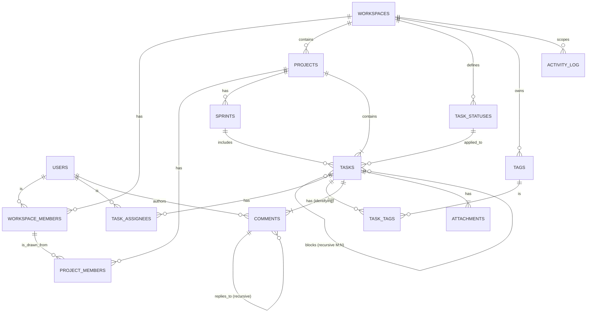

# COM2058 Project — Phase 2: ER + Relational Schema Explanation

**Project:** TaskNest — Multi-Tenant Project Management SaaS
**Course:** COM2058 Database Management Systems, Ankara University
**Author:** Berk Kırık
**Date:** 2026-04-21
**Phase 2 Weight:** 20% — Due: 2026-04-26
**Notation:** Page 1 — Chen ER (Elmasri 6e Ch07, Fig 7.15 style). Page 2 — Relational schema (Elmasri 6e Ch09, Fig 9.1 style).

**Files:**
- `phase2_er_diagram.drawio` — editable source, 2 pages:
  - Page 1 · ER Schema (conceptual, Chen notation)
  - Page 2 · Relational Schema (logical, tables + columns + FK arrows)
- `phase2_er_diagram.png` — exported image (open the .drawio file in draw.io desktop, then File → Export As → PNG, recommended 300 DPI)
- This document — element-by-element explanation aligned with both pages

---

## How to Open & Export

```bash
# macOS
open -a "draw.io" docs/phase2_er_diagram.drawio
# Then: File → Export As → PNG (Border 20, Zoom 200%, Background White)
# Save as: docs/phase2_er_diagram.png
```

If draw.io desktop is not installed, you can also open the `.drawio` file at https://app.diagrams.net (web version, no install).

---

## Notation Key

| Symbol | Meaning |
|--------|---------|
| Rectangle | Entity type |
| **Double-bordered rectangle** | **Weak entity** (no independent identity) |
| Diamond | Relationship type |
| **Double-bordered diamond** | **Identifying relationship** (binds weak entity to its owner) |
| Ellipse | Attribute |
| Double ellipse | Multivalued attribute (modeled in this project as a separate relation table) |
| Dashed ellipse | Derived attribute |
| Underlined attribute | Primary key (in attribute names: `*` suffix denotes key membership) |
| Single line connecting entity to relationship | **Partial participation** (the entity may exist without participating) |
| Double line | **Total participation** (every instance MUST participate) |
| `1`, `M`, `N` labels on edges | Cardinality ratio |

---

## Mermaid Quick-Reference (for GitHub preview)

The .drawio file is the canonical Phase 2 deliverable; this Mermaid diagram is provided as a quick visual cross-check (Mermaid does not support full Chen notation; edges are simplified).



---

## Element-by-Element Walkthrough

The numbering corresponds to the visual reading order in the diagram (top-left → top-right → middle → bottom).

### §1 — USERS

**(1.1) `USERS` entity (top-left)**
The base entity for all platform participants. Attributes: `user_id` (PK), `email`, `password_hash`, `display_name`, `KIND`, `created_at`. `KIND ∈ {internal, external, bot, guest}` is a discriminator column (kept as a plain attribute in the ER model).

### §2 — WORKSPACES

**(2.1) `WORKSPACES` entity (top-center)**
Tenant root. Attributes: `workspace_id` (PK), `slug`, `name`, `created_at`.

### §3 — Workspace Membership (M:N + role attribute)

**(3.1) `HAS_MEMBER` diamond (red, between USERS and WORKSPACES)**
A many-to-many relationship between users and workspaces, **carrying a `role` attribute** on the relationship itself (shown in braces `{role}`). When mapped to relations, this becomes the `workspace_members` associative table with columns `(workspace_id, user_id, role)`.

Cardinality: M (user) — N (workspace). Workspace participation is **total** (assertion: every workspace must have ≥ 1 member, in fact ≥ 1 owner). User participation is partial (a freshly-registered user may not yet belong to any workspace).

### §4 — Projects and Project Membership

**(4.1) `WORKSPACES → CONTAINS → PROJECTS` (1:N total)**
Every project belongs to exactly one workspace (total participation on project side, partial on workspace side — a workspace may have zero projects).

**(4.2) `PROJECT_MEMBERS` via `ON_PROJECT` diamond (M:N + role)**
The diamond connects `HAS_MEMBER` (the workspace_members associative table) to `PROJECTS`, not directly to `USERS`. This subtle difference is a deliberate referential safety choice: project membership inherits from workspace membership, so a non-workspace user cannot be added to a project.

### §5 — Status, Sprint, and Task Setup

**(5.1) `TASK_STATUSES`**
Workspace-scoped lookup table. Replaces a hardcoded ENUM with a configurable per-workspace status workflow. Demonstrates the **Ch15 lookup-table benefit**: status text changes don't require schema modifications, and statuses can be added/reordered per tenant.

**(5.2) `SPRINTS`**
Optional iteration container. A task may belong to at most one sprint (nullable FK). Demonstrates a **1:N relationship with partial participation on the task side**.

### §6 — TASKS (Central Hub)

**(6.1) `TASKS` entity (large blue rectangle, center)**
The operational center of the schema. Notable attributes:
- `workspace_id` (denormalized, with composite FK to projects — see §11 below)
- `project_id` (NOT NULL — total participation on project relationship)
- `sprint_id?` (nullable — partial participation on sprint relationship)
- `parent_task_id?` (nullable self-FK for subtask hierarchy)
- `status_id`, `priority`, `due_date`, `completed_at`

**(6.2) `SUBTASK_OF` (recursive 1:N)**
A task can have a parent task. Cardinality: 1 parent — N children. Both sides partial (top-level tasks have no parent; leaf tasks have no children). Forms a tree per project.

**(6.3) `BLOCKS` (recursive M:N)**
A separate diamond for the dependency graph. A task may block N other tasks and be blocked by M other tasks. Maps to the `task_dependencies(from_task_id, to_task_id)` table. The acyclicity constraint is enforced by application logic (discussed in Phase 4).

### §7 — Task Assignment

**(7.1) `ASSIGNED_TO` diamond (with `{role}` attribute)**
M:N between users and tasks, with a role on the relationship. The same user can be assigned to the same task in multiple roles (implementer, reviewer, tester) — so the PK on the resulting table is `(task_id, user_id, role)`, not just `(task_id, user_id)`.

### §8 — Tags (M:N, multi-valued attribute → relation)

**(8.1) `TAGS` entity (workspace-scoped)**
Each tag belongs to a single workspace; tag names are unique within a workspace. Demonstrates Ch15's **1NF requirement**: a multi-valued attribute "tags" on tasks would violate 1NF, so it is decomposed into `tags` and `task_tags` tables.

**(8.2) `TAGGED_AS` diamond (M:N between tasks and tags)**

### §9 — COMMENTS (Weak Entity + Identifying Relationship + Recursive)

**(9.1) `COMMENTS` weak entity (yellow rectangle with **double border**, right side)**
Comments have no identity outside their parent task. The composite primary key is `(task_id, comment_no)` where `comment_no` is the **partial key** (auto-numbered within each task). This is the textbook Ch07 weak entity example.

**(9.2) `HAS_COMMENT` identifying relationship (red diamond with **double border**)**
The double diamond denotes an identifying relationship — without it, a comment cannot exist. Total participation on the comment side (every comment belongs to exactly one task).

**(9.3) `AUTHORS` relationship (USERS → COMMENTS)**
Every comment has exactly one author (total on comment side, partial on user side).

**(9.4) `REPLIES_TO` recursive relationship**
A second recursive relationship in the schema (the first being `SUBTASK_OF`). Comments can be threaded — a reply has a `parent_comment_id`. Forms a tree per task.

### §10 — ATTACHMENTS

**(10.1) `ATTACHMENTS` entity (lower right)**
Attributes: `attachment_id` (PK), `task_id` (FK), `uploaded_by`, `attachment_type` (discriminator kept as plain attribute), `original_name`, `uploaded_at`.

### §11 — ACTIVITY_LOG (Polymorphic Audit)

**(11.1) `ACTIVITY_LOG` (blue rectangle, lower-left)**
Append-only audit log. The `entity_type` and `entity_id` columns form a **polymorphic association** — they reference different tables depending on the value of `entity_type`. There is no foreign key on `entity_id` because it can target tasks, comments, projects, members, or statuses.

This is a deliberate **controlled denormalization**: the loss of strict referential integrity is the cost of having a single uniform audit log table. The trade-off is explicitly discussed in the Phase 4 report (Ch15 normalization section).

---

## Cardinality + Participation Summary Table

| # | Relationship | Left | Cardinality | Right | Left Part. | Right Part. |
|---|---|---|---|---|---|---|
| R1 | `USERS — HAS_MEMBER — WORKSPACES` | USERS | M:N | WORKSPACES | partial | total (≥1 owner) |
| R2 | `WORKSPACES — CONTAINS — PROJECTS` | WORKSPACES | 1:N | PROJECTS | partial | **total** |
| R3 | `WORKSPACE_MEMBERS — ON_PROJECT — PROJECTS` | WS_MEMBERS | M:N | PROJECTS | partial | partial |
| R4 | `WORKSPACES — DEFINES — TASK_STATUSES` | WORKSPACES | 1:N | STATUSES | partial | total |
| R5 | `WORKSPACES — OWNS — TAGS` | WORKSPACES | 1:N | TAGS | partial | total |
| R6 | `PROJECTS — HAS — SPRINTS` | PROJECTS | 1:N | SPRINTS | partial | total |
| R7 | `PROJECTS — HAS_TASK — TASKS` | PROJECTS | 1:N | TASKS | partial | **total** |
| R8 | `SPRINTS — INCLUDES — TASKS` | SPRINTS | 1:N | TASKS | partial | partial |
| R9 | `TASK_STATUSES — APPLIED_TO — TASKS` | STATUSES | 1:N | TASKS | partial | total |
| R10 | `TASKS — SUBTASK_OF — TASKS` | TASKS | 1:N recursive | TASKS | partial | partial |
| R11 | `TASKS — BLOCKS — TASKS` | TASKS | M:N recursive | TASKS | partial | partial |
| R12 | `TASKS — ASSIGNED_TO — USERS` (with role) | TASKS | M:N | USERS | partial | partial |
| R13 | `TASKS — TAGGED_AS — TAGS` | TASKS | M:N | TAGS | partial | partial |
| R14 | `TASKS — HAS_COMMENT — COMMENTS` (identifying) | TASKS | 1:N **identifying** | COMMENTS | partial | **total** |
| R15 | `USERS — AUTHORS — COMMENTS` | USERS | 1:N | COMMENTS | partial | total |
| R16 | `COMMENTS — REPLIES_TO — COMMENTS` | COMMENTS | 1:N recursive | COMMENTS | partial | partial |
| R17 | `TASKS — HAS_ATTACHMENT — ATTACHMENTS` | TASKS | 1:N | ATTACHMENTS | partial | **total** |
| R23 | `(any state-changing) → ACTIVITY_LOG` (polymorphic) | various | 1:N polymorphic | ACTIVITY_LOG | partial | partial |

---

## Page 2 — Relational Schema (Fig 9.1 style)

The relational schema is the logical-level mapping of the ER diagram on Page 1, following Elmasri Ch09 Algorithm 9.1 (ER-to-Relational mapping). Each ER entity becomes a table; each M:N relationship becomes an associative table; each 1:N relationship becomes a foreign key on the child side.

### Reading the diagram

- Each table is rendered as a **header bar** (table name) sitting above a **row of column cells**.
- Inside every column cell: **column name** on top (underlined = primary key), **datatype** on the bottom.
- `(FK)` in the column name denotes a foreign key. `(FK,null)` denotes a nullable FK. An arrow leaves the FK column and terminates at the referenced PK column.
- Header colors encode category: **blue** = strong entity, **green** = associative (M:N resolution), **orange** = weak entity, **yellow** = audit/polymorphic.
- Arrow colors encode FK target (29 arrows, distinguishable when overlapping): **blue** → `workspaces`, **red** → `users`, **purple** → `projects`, **green** → `tasks`, **orange** → `task_statuses`/`tags`/`sprints`, **gray** = self-reference. Long-distance arrows route through a left channel (x≈30) or right channel (x≈2180) to avoid crossing intervening tables; horizontal segments sit in the inter-row gaps.

### Tables (15 total)

Every tenant-scoped table (all except `users`) carries a `workspace_id (FK)` column — see **Multi-Tenancy Enforcement** below.

| # | Table | Columns | Category |
|---|---|---|---|
| T1 | `workspaces` | workspace_id*, slug, name, created_at | Strong (tenant root) |
| T2 | `users` | user_id*, email, password_hash, display_name, kind, created_at | Strong (global) |
| T3 | `workspace_members` | workspace_id*†, user_id*†, role, joined_at | Associative (M:N) |
| T4 | `task_statuses` | status_id*, workspace_id†, name, display_order, is_terminal | Strong (lookup) |
| T5 | `tags` | tag_id*, workspace_id†, name, color | Strong |
| T6 | `projects` | project_id*, workspace_id†, slug, name, created_by†, created_at, archived_at | Strong |
| T7 | `sprints` | sprint_id*, project_id†, name, started_at, ended_at, goal, workspace_id† | Strong |
| T8 | `project_members` | workspace_id*†, user_id*†, project_id*†, role | Associative (M:N) |
| T9 | `task_assignees` | task_id*†, user_id*†, role*, workspace_id† | Associative (M:N + attribute in PK) |
| T10 | `task_dependencies` | from_task_id*†, to_task_id*†, workspace_id† | Associative (recursive M:N) |
| T11 | `task_tags` | task_id*†, tag_id*†, workspace_id† | Associative (M:N) |
| T12 | `tasks` | task_id*, workspace_id†, project_id†, sprint_id†?, parent_task_id†?, status_id†, title, description, priority, created_by†, due_date, completed_at, created_at, updated_at | Strong (central hub) |
| T13 | `comments` | task_id*†, comment_no*, parent_comment_id†?, author_user_id†, body, created_at, edited_at, workspace_id† | Weak (identified by owner) |
| T14 | `attachments` | attachment_id*, task_id†, uploaded_by†, attachment_type, original_name, uploaded_at, workspace_id† | Strong |
| T15 | `activity_log` | event_id*, workspace_id†, actor_user_id†?, entity_type, entity_id, action, payload_json, occurred_at | Audit (polymorphic) |

Legend: `*` = primary key, `†` = foreign key, `?` = nullable.

### Fully Multi-Tenant Many-to-Many Architecture

The schema is designed for **shared-schema multi-tenancy with M:N relationships everywhere**: one physical database, many tenants (workspaces), and users/tasks/tags participate in many-to-many associations that never leak across tenants.

#### The five M:N relationships (all tenant-scoped)

| Relationship | Bridge table | Primary key | Carries per-association data |
|---|---|---|---|
| users ↔ workspaces | `workspace_members` | `(workspace_id, user_id)` | `role`, `joined_at` (role can differ per workspace) |
| users ↔ projects | `project_members` | `(workspace_id, user_id, project_id)` | `role` (role can differ per project) |
| users ↔ tasks | `task_assignees` | `(task_id, user_id, role)` | `role` in PK — a user may hold multiple roles on one task |
| tasks ↔ tags | `task_tags` | `(task_id, tag_id)` | — |
| tasks ↔ tasks (recursive) | `task_dependencies` | `(from_task_id, to_task_id)` | — |

Every bridge table carries `workspace_id` as a non-null FK — so every M:N association is *anchored to a specific tenant*.

#### Shared-schema pattern (one DB, many tenants)

1. **Tenant root**: `workspaces` is the single source of tenant identity. Every tenant = one row here.
2. **Tenant anchor on every scoped table**: `workspace_id` is a non-null FK on `workspace_members`, `task_statuses`, `tags`, `projects`, `sprints`, `project_members`, `tasks`, `task_assignees`, `task_dependencies`, `task_tags`, `comments`, `attachments`, `activity_log` (13 of 14 non-root tables). Only `users` is tenant-agnostic (a user may belong to multiple workspaces via `workspace_members`).
3. **Composite FKs prevent cross-tenant leaks**: the denormalized `workspace_id` is not just ornamental — it participates in composite FKs that force every reference to land in the same tenant. Examples (all enforced at the database level via `UNIQUE(workspace_id, <id>)` on parents + composite FK on children):
   - `tasks(workspace_id, project_id) → projects(workspace_id, project_id)` — prevents a task from referencing a project in a different workspace.
   - `sprints(workspace_id, project_id) → projects(workspace_id, project_id)` — same guarantee for sprints.
   - `comments(workspace_id, task_id) → tasks(workspace_id, task_id)` — weak entity cannot escape its owner's tenant.
   - `attachments(workspace_id, task_id) → tasks(workspace_id, task_id)` — same.
   - `task_assignees(workspace_id, task_id) → tasks(...)` and `task_assignees(workspace_id, user_id) → workspace_members(...)` — an assignee must already be a member of the task's workspace.
   - `task_dependencies(workspace_id, from_task_id) → tasks(...)` and same for `to_task_id` — no cross-tenant blockers.
   - `task_tags(workspace_id, tag_id) → tags(workspace_id, tag_id)` — tags cannot be applied across tenants.
   - `project_members(workspace_id, project_id) → projects(...)`, `(workspace_id, user_id) → workspace_members(...)` — both already shown in the diagram as part of the composite PK.
4. **Single-column tenant filter**: every query that should be tenant-scoped can add `WHERE workspace_id = :current_tenant` on a single column — no joins required for the filter itself. This is the key enabler for PostgreSQL Row-Level Security (RLS) policies.
5. **Tenant-aware indexes**: production DDL will start every index with `workspace_id` (e.g., `CREATE INDEX ON tasks(workspace_id, project_id, status_id)`), so the query planner can prune by tenant first.

**Left out of the diagram (Phase 4 DDL material)**: the `UNIQUE(workspace_id, <id>)` constraints on parents, the actual `REFERENCES ... (workspace_id, <id>)` composite-FK clauses, the RLS policies (`CREATE POLICY tenant_isolation ON tasks USING (workspace_id = current_setting('app.workspace_id')::bigint)`), and the composite indexes. The column layout in Page 2 is the *structural precondition* for all of those; the DDL/operational layer lives in Phase 4.

### Foreign Key Inventory (29 arrows drawn on Page 2)

| FK | Source (table.column) | References (table.column) | Semantic |
|----|-----------------------|----------------------------|----------|
| 1 | `workspace_members.workspace_id` | `workspaces.workspace_id` | tenant root |
| 2 | `workspace_members.user_id` | `users.user_id` | member identity |
| 3 | `task_statuses.workspace_id` | `workspaces.workspace_id` | workspace-scoped lookup |
| 4 | `tags.workspace_id` | `workspaces.workspace_id` | workspace-scoped tag |
| 5 | `projects.workspace_id` | `workspaces.workspace_id` | project ⊂ workspace |
| 6 | `projects.created_by` | `users.user_id` | audit author |
| 7 | `sprints.project_id` | `projects.project_id` | sprint ⊂ project |
| 8 | `project_members.workspace_id` | `workspaces.workspace_id` | composite tenant anchor |
| 9 | `project_members.user_id` | `users.user_id` | member identity |
| 10 | `project_members.project_id` | `projects.project_id` | project membership |
| 11 | `task_assignees.task_id` | `tasks.task_id` | assignment subject |
| 12 | `task_assignees.user_id` | `users.user_id` | assignee identity |
| 13 | `task_dependencies.from_task_id` | `tasks.task_id` | blocker side |
| 14 | `task_dependencies.to_task_id` | `tasks.task_id` | blocked side |
| 15 | `task_tags.task_id` | `tasks.task_id` | tagged task |
| 16 | `task_tags.tag_id` | `tags.tag_id` | tag reference |
| 17 | `tasks.workspace_id` | `workspaces.workspace_id` | denormalized tenant anchor |
| 18 | `tasks.project_id` | `projects.project_id` | task ⊂ project |
| 19 | `tasks.sprint_id` | `sprints.sprint_id` | optional sprint link (nullable) |
| 20 | `tasks.parent_task_id` | `tasks.task_id` | subtask recursion (nullable self) |
| 21 | `tasks.status_id` | `task_statuses.status_id` | current workflow status |
| 22 | `tasks.created_by` | `users.user_id` | audit author |
| 23 | `comments.task_id` | `tasks.task_id` | identifying relationship (weak entity owner) |
| 24 | `comments.parent_comment_id` | `comments.comment_no` | thread recursion (partial-key self-ref) |
| 25 | `comments.author_user_id` | `users.user_id` | author |
| 26 | `attachments.task_id` | `tasks.task_id` | attachment owner |
| 27 | `attachments.uploaded_by` | `users.user_id` | uploader |
| 28 | `activity_log.workspace_id` | `workspaces.workspace_id` | tenant scope |
| 29 | `activity_log.actor_user_id` | `users.user_id` | event actor (nullable for system events) |

### Mapping Notes (ER → Relational)

- **Strong entities (T1, T2, T4–T7, T12, T14, T15)** — each becomes a table with its own surrogate `*_id BIGINT` PK.
- **Weak entity `COMMENTS` (T13)** — composite PK `(task_id, comment_no)` where `task_id` is the identifying FK and `comment_no` is the partial key (Elmasri Ch09 Step 2).
- **M:N relationships (T3, T8, T9, T10, T11)** — each becomes its own associative table. PK = union of component FKs. `task_assignees` additionally includes `role` in the PK because a single user can be assigned to the same task in different roles.
- **Recursive relationships** — `tasks.parent_task_id → tasks.task_id` (nullable self-FK for subtree) and `task_dependencies` (separate table for M:N recursion `BLOCKS`). `comments.parent_comment_id` mirrors this for reply threads.
- **Polymorphic association (`activity_log`)** — `entity_type + entity_id` carries no FK because the referenced table varies per row. This is a deliberate controlled denormalization (discussed further in the Phase 4 Report).
- **Multi-tenant denormalization** — `workspace_id` is repeated on `tasks`, `task_statuses`, `tags`, `projects` etc. Enforcement of referential consistency is delegated to composite FKs (e.g., `tasks(workspace_id, project_id)` → `projects(workspace_id, project_id)`) which prevents a task from drifting to a project in a different workspace.

---

## Notes for the Phase 4 Report (Further Mapping / Normalization)

When extending this schema in Phase 4 (Ch09 + Ch15), the following deeper decisions will be elaborated:

1. **Recursive relationships:** Self-referencing FK columns (no separate table needed for 1:N recursive; separate table for M:N recursive — `task_dependencies`).
2. **Polymorphic association (activity_log):** Discriminator + entity_id without FK; documented as deliberate denormalization in the Ch15 normalization section.
3. **Multi-tenant denormalization:** `workspace_id` denormalized to `tasks` (and downstream tables), enforced via composite FK `(workspace_id, project_id)` to prevent drift — controlled 3NF violation, the report's signature normalization trade-off discussion.

---

*End of Phase 2 ER + Relational Schema Explanation.*
