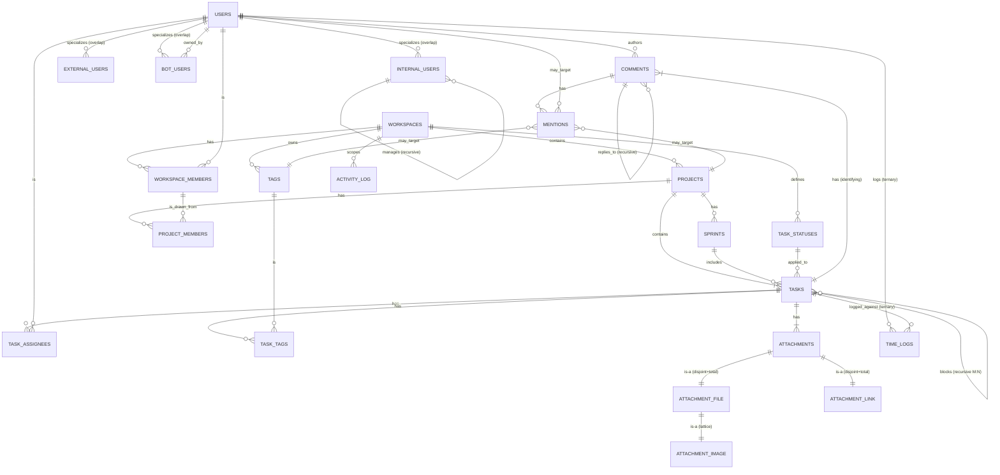

# COM2058 Project — Phase 2: ER + EER Diagram Explanation

**Project:** TaskNest — Multi-Tenant Project Management SaaS
**Course:** COM2058 Database Management Systems, Ankara University
**Author:** Berk Kırık
**Date:** 2026-04-19
**Phase 2 Weight:** 20% — Due: 2026-04-26
**Notation:** Chen (Elmasri 6e Ch07-08)

**Files:**
- `phase2_er_diagram.drawio` — editable source
- `phase2_er_diagram.png` — exported image (open the .drawio file in draw.io desktop, then File → Export As → PNG, recommended 300 DPI)
- This document — element-by-element explanation aligned with the diagram

---

## How to Open & Export

```bash
# macOS
open -a "draw.io" docs/phase2_er_diagram.drawio
# Then: File → Export As → PNG (Border 20, Zoom 200%, Background White)
# Save as: docs/phase2_er_diagram.png
```

If draw.io desktop is not installed, you can also open the `.drawio` file at https://app.diagrams.net (web version, no install).

---

## Notation Key

| Symbol | Meaning |
|--------|---------|
| Rectangle | Entity type |
| **Double-bordered rectangle** | **Weak entity** (no independent identity) |
| Diamond | Relationship type |
| **Double-bordered diamond** | **Identifying relationship** (binds weak entity to its owner) |
| Ellipse | Attribute |
| Double ellipse | Multivalued attribute (modeled in this project as a separate relation table) |
| Dashed ellipse | Derived attribute |
| Underlined attribute | Primary key (in attribute names: `*` suffix denotes key membership) |
| Single line connecting entity to relationship | **Partial participation** (the entity may exist without participating) |
| Double line | **Total participation** (every instance MUST participate) |
| `1`, `M`, `N` labels on edges | Cardinality ratio |
| Circle with `d` | EER **disjoint** specialization |
| Circle with `o` | EER **overlapping** specialization |
| `⊂` (subset symbol) on edge to subclass | IS-A relationship |
| `∪` (union symbol) | EER **category** (union type) |
| Dashed bounded box around relationship + entities | EER **aggregation** |

---

## Mermaid Quick-Reference (for GitHub preview)

The .drawio file is the canonical Phase 2 deliverable; this Mermaid diagram is provided as a quick visual cross-check (Mermaid does not support full Chen/EER notation — specialization, category, and aggregation are simplified to relationship lines).



---

## Element-by-Element Walkthrough

The numbering corresponds to the visual reading order in the diagram (top-left → top-right → middle → bottom).

### §1 — USERS and EER Specialization (Ch08)

**(1.1) `USERS` entity (top-left, blue rectangle)**
The base entity for all platform participants. The discriminator attribute `KIND ∈ {internal, external, bot, guest}` drives a **predicate-defined specialization**. Attributes shown: `user_id` (PK), `email`, `password_hash`, `display_name`, `KIND`, `created_at`.

**(1.2) Specialization circle "o" (yellow circle marked `o`)**
The `o` denotes an **overlapping** specialization — a single user can simultaneously belong to multiple subclasses (e.g., an internal employee who also registers a bot). The single line from `USERS` to the circle indicates **partial** participation: a `guest` user has no row in any subclass.

**(1.3-1.5) Subclasses `INTERNAL_USERS`, `EXTERNAL_USERS`, `BOT_USERS` (green rectangles)**
- `INTERNAL_USERS`: employees with `employee_no`, `hired_at`, and a self-referencing `manager_user_id` for org chart.
- `EXTERNAL_USERS`: contractors with `company_name`, `hourly_rate`, `currency`.
- `BOT_USERS`: service accounts with `api_key_hash` and `owner_user_id` (FK to a non-bot user who owns the bot).

The `⊂` symbol on each edge denotes the IS-A inheritance.

**(1.6) `MANAGES` recursive relationship**
A red diamond between `INTERNAL_USERS` and itself. Cardinality: 1 manager per internal user, N reports per manager. This is a **recursive (unary) relationship** demonstrating Ch07's "recursive relationships" concept.

### §2 — WORKSPACES and Composite Attribute (Ch07)

**(2.1) `WORKSPACES` entity (top-center, blue rectangle)**
Tenant root. Attributes: `workspace_id` (PK), `slug`, `name`, `created_at`.

**(2.2) Composite attribute `address` (yellow ellipse with sub-ellipses)**
Demonstrates **Ch07 composite attribute**: a single conceptual attribute (`address`) decomposed into atomic parts (`street`, `city`, `country`, `postal`). In the relational mapping, these become four columns on the workspaces table.

### §3 — Workspace Membership (M:N + role attribute)

**(3.1) `HAS_MEMBER` diamond (red, between USERS and WORKSPACES)**
A many-to-many relationship between users and workspaces, **carrying a `role` attribute** on the relationship itself (shown in braces `{role}`). When mapped to relations, this becomes the `workspace_members` associative table with columns `(workspace_id, user_id, role)`.

Cardinality: M (user) — N (workspace). Workspace participation is **total** (assertion: every workspace must have ≥ 1 member, in fact ≥ 1 owner). User participation is partial (a freshly-registered user may not yet belong to any workspace).

### §4 — Projects and Project Membership

**(4.1) `WORKSPACES → CONTAINS → PROJECTS` (1:N total)**
Every project belongs to exactly one workspace (total participation on project side, partial on workspace side — a workspace may have zero projects).

**(4.2) `PROJECT_MEMBERS` via `ON_PROJECT` diamond (M:N + role)**
The diamond connects `HAS_MEMBER` (the workspace_members associative table) to `PROJECTS`, not directly to `USERS`. This subtle difference is a deliberate referential safety choice: project membership inherits from workspace membership, so a non-workspace user cannot be added to a project.

### §5 — Status, Sprint, and Task Setup

**(5.1) `TASK_STATUSES`**
Workspace-scoped lookup table. Replaces a hardcoded ENUM with a configurable per-workspace status workflow. Demonstrates the **Ch15 lookup-table benefit**: status text changes don't require schema modifications, and statuses can be added/reordered per tenant.

**(5.2) `SPRINTS`**
Optional iteration container. A task may belong to at most one sprint (nullable FK). Demonstrates a **1:N relationship with partial participation on the task side**.

### §6 — TASKS (Central Hub)

**(6.1) `TASKS` entity (large blue rectangle, center)**
The operational center of the schema. Notable attributes:
- `workspace_id` (denormalized, with composite FK to projects — see §11 below)
- `project_id` (NOT NULL — total participation on project relationship)
- `sprint_id?` (nullable — partial participation on sprint relationship)
- `parent_task_id?` (nullable self-FK for subtask hierarchy)
- `status_id`, `priority`, `due_date`, `completed_at`

**(6.2) `SUBTASK_OF` (recursive 1:N)**
A task can have a parent task. Cardinality: 1 parent — N children. Both sides partial (top-level tasks have no parent; leaf tasks have no children). Forms a tree per project.

**(6.3) `BLOCKS` (recursive M:N)**
A separate diamond for the dependency graph. A task may block N other tasks and be blocked by M other tasks. Maps to the `task_dependencies(from_task_id, to_task_id)` table. The acyclicity constraint is enforced by application logic (discussed in Phase 4).

### §7 — Task Assignment and the AGGREGATION (Ch08)

**(7.1) `ASSIGNED_TO` diamond (with `{role}` attribute)**
M:N between users and tasks, with a role on the relationship. The same user can be assigned to the same task in multiple roles (implementer, reviewer, tester) — so the PK on the resulting table is `(task_id, user_id, role)`, not just `(task_id, user_id)`.

**(7.2) Aggregation box (purple dashed rectangle around `USERS — ASSIGNED_TO — TASKS`)**
Demonstrates **EER aggregation**: the relationship `ASSIGNED_TO` is itself treated as a higher-level entity, conceptually called "Assignment". This is significant because `TIME_LOGS` (§9) semantically relates to an *assignment* — you can only log time on a task you are assigned to. The aggregation form would model `time_logs` as a relationship from `Assignment` to `Date` instead of a raw ternary.

In the implementation we keep `time_logs` as a ternary table for simplicity, but the Phase 4 report explicitly compares both modeling approaches.

### §8 — Tags (M:N, multi-valued attribute → relation)

**(8.1) `TAGS` entity (workspace-scoped)**
Each tag belongs to a single workspace; tag names are unique within a workspace. Demonstrates Ch15's **1NF requirement**: a multi-valued attribute "tags" on tasks would violate 1NF, so it is decomposed into `tags` and `task_tags` tables.

**(8.2) `TAGGED_AS` diamond (M:N between tasks and tags)**

### §9 — COMMENTS (Weak Entity + Identifying Relationship + Recursive)

**(9.1) `COMMENTS` weak entity (yellow rectangle with **double border**, right side)**
Comments have no identity outside their parent task. The composite primary key is `(task_id, comment_no)` where `comment_no` is the **partial key** (auto-numbered within each task). This is the textbook Ch07 weak entity example.

**(9.2) `HAS_COMMENT` identifying relationship (red diamond with **double border**)**
The double diamond denotes an identifying relationship — without it, a comment cannot exist. Total participation on the comment side (every comment belongs to exactly one task).

**(9.3) `AUTHORS` relationship (USERS → COMMENTS)**
Every comment has exactly one author (total on comment side, partial on user side).

**(9.4) `REPLIES_TO` recursive relationship**
A second recursive relationship in the schema (the first being `SUBTASK_OF`). Comments can be threaded — a reply has a `parent_comment_id`. Forms a tree per task.

### §10 — ATTACHMENTS (EER Specialization + Lattice)

**(10.1) `ATTACHMENTS` superclass (blue rectangle, lower right)**
Holds attributes common to all attachment types: `attachment_id` (PK), `task_id`, `uploaded_by`, `attachment_type` (discriminator), `original_name`, `uploaded_at`.

**(10.2) Specialization circle "d" (yellow circle marked `d`)**
The `d` denotes a **disjoint** specialization — every attachment belongs to exactly one subclass. The double line from `ATTACHMENTS` to the circle indicates **total** participation: every attachment row MUST have a corresponding subclass row.

**(10.3) Subclasses `ATTACHMENT_FILE` and `ATTACHMENT_LINK` (green)**
- `ATTACHMENT_FILE`: file_size, mime_type, storage_path
- `ATTACHMENT_LINK`: url, preview_text

**(10.4) `ATTACHMENT_IMAGE` — Lattice / Multiple Inheritance (purple rectangle)**
Image attachments inherit from BOTH `ATTACHMENTS` AND `ATTACHMENT_FILE`. Every image is also a file (it has size, mime_type, storage_path) plus image-specific attributes (`width`, `height`). This is a **2-level lattice / multiple-inheritance specialization** — a Ch08 hierarchy concept.

In the relational mapping (Phase 4), this is implemented via composite foreign keys with the discriminator column, so the database guarantees:
- An image row's `attachment_type` = `'image'`
- An image row's referenced `attachment_file` row also has `attachment_type` = `'image'` (transitively confirms it is both an image and a file)

This is the project's most pedagogically dense Ch08 demonstration.

### §11 — TIME_LOGS (Ternary Relationship)

**(11.1) `TIME_LOG` ternary relationship (yellow diamond, **bold border**)**
A genuine ternary relationship between `USERS`, `TASKS`, and `DATE`. The relationship carries the `hours_logged` and `note` attributes. Mapped to a `time_logs(user_id, task_id, log_date, hours_logged, note)` table with PK `(user_id, task_id, log_date)`.

**(11.2) `DATE` entity**
A weak entity in the strict sense — `log_date` is the partial key. Modeled as a column rather than a separate table for simplicity, but conceptually present in the ER.

**Argument for genuine ternary (vs. binary decomposition):** The constraint "a user can log distinct hours on the same task across multiple days" cannot be captured by binaries `user—works_on—task` + `task—logged_on—date`. The triple `(user, task, date)` together is required to identify a unique fact and its `hours_logged`. The Phase 4 report explicitly walks through this argument.

### §12 — MENTIONS (EER Category / Union Type)

**(12.1) `MENTIONABLE` category (purple rectangle below the `∪` circle)**
A **category** (or **union type**) — formed by the union of three entities with **different keys**: `USERS`, `TAGS`, `PROJECTS`. The `∪` symbol on the circle denotes the union. Each `MENTIONABLE` instance corresponds to exactly one user OR one tag OR one project.

This is distinct from specialization because users, tags, and projects are independent entities that don't share a common superclass. A category is the correct EER construct (Ch08).

**(12.2) Mapping decision (in Phase 4)**
At the relational level, this is implemented as a `mentions` table with a discriminator column `target_type` and three nullable foreign keys (one of which must be non-NULL, enforced by CHECK constraint).

**(12.3) `MENTIONS` relationship**
Connects `COMMENTS` (M side) to `MENTIONABLE` (N side). A comment can mention many entities; an entity can be mentioned in many comments.

### §13 — ACTIVITY_LOG (Polymorphic Audit)

**(13.1) `ACTIVITY_LOG` (blue rectangle, lower-left)**
Append-only audit log. The `entity_type` and `entity_id` columns form a **polymorphic association** — they reference different tables depending on the value of `entity_type`. There is no foreign key on `entity_id` because it can target tasks, comments, projects, members, or statuses.

This is a deliberate **controlled denormalization**: the loss of strict referential integrity is the cost of having a single uniform audit log table. The trade-off is explicitly discussed in the Phase 4 report (Ch15 normalization section).

---

## Cardinality + Participation Summary Table

| # | Relationship | Left | Cardinality | Right | Left Part. | Right Part. |
|---|---|---|---|---|---|---|
| R1 | `USERS — HAS_MEMBER — WORKSPACES` | USERS | M:N | WORKSPACES | partial | total (≥1 owner) |
| R2 | `WORKSPACES — CONTAINS — PROJECTS` | WORKSPACES | 1:N | PROJECTS | partial | **total** |
| R3 | `WORKSPACE_MEMBERS — ON_PROJECT — PROJECTS` | WS_MEMBERS | M:N | PROJECTS | partial | partial |
| R4 | `WORKSPACES — DEFINES — TASK_STATUSES` | WORKSPACES | 1:N | STATUSES | partial | total |
| R5 | `WORKSPACES — OWNS — TAGS` | WORKSPACES | 1:N | TAGS | partial | total |
| R6 | `PROJECTS — HAS — SPRINTS` | PROJECTS | 1:N | SPRINTS | partial | total |
| R7 | `PROJECTS — HAS_TASK — TASKS` | PROJECTS | 1:N | TASKS | partial | **total** |
| R8 | `SPRINTS — INCLUDES — TASKS` | SPRINTS | 1:N | TASKS | partial | partial |
| R9 | `TASK_STATUSES — APPLIED_TO — TASKS` | STATUSES | 1:N | TASKS | partial | total |
| R10 | `TASKS — SUBTASK_OF — TASKS` | TASKS | 1:N recursive | TASKS | partial | partial |
| R11 | `TASKS — BLOCKS — TASKS` | TASKS | M:N recursive | TASKS | partial | partial |
| R12 | `TASKS — ASSIGNED_TO — USERS` (with role) | TASKS | M:N | USERS | partial | partial |
| R13 | `TASKS — TAGGED_AS — TAGS` | TASKS | M:N | TAGS | partial | partial |
| R14 | `TASKS — HAS_COMMENT — COMMENTS` (identifying) | TASKS | 1:N **identifying** | COMMENTS | partial | **total** |
| R15 | `USERS — AUTHORS — COMMENTS` | USERS | 1:N | COMMENTS | partial | total |
| R16 | `COMMENTS — REPLIES_TO — COMMENTS` | COMMENTS | 1:N recursive | COMMENTS | partial | partial |
| R17 | `TASKS — HAS_ATTACHMENT — ATTACHMENTS` | TASKS | 1:N | ATTACHMENTS | partial | **total** |
| R18 | `ATTACHMENTS specializes {file, image, link}` | EER spec | disjoint+total | (3 subclasses) | total | total |
| R19 | `ATTACHMENT_FILE specializes {image}` (lattice) | EER spec | (lattice) | ATTACHMENT_IMAGE | partial | total |
| R20 | `USERS × TASKS × DATE — TIME_LOG` (ternary) | USERS, TASKS, DATE | M:N:N | (relationship) | partial | partial |
| R21 | `COMMENTS — MENTIONS — MENTIONABLE` (category) | COMMENTS | M:N | MENTIONABLE | partial | partial |
| R22 | `MENTIONABLE = USERS ∪ TAGS ∪ PROJECTS` (union) | (3 supers) | category | MENTIONABLE | partial | total |
| R23 | `(any state-changing) → ACTIVITY_LOG` (polymorphic) | various | 1:N polymorphic | ACTIVITY_LOG | partial | partial |

---

## EER Concepts Coverage Checklist

This diagram demonstrates the following Elmasri Ch07-08 concepts (every item required to be in the diagram):

| Ch07 Concept | Where in Diagram |
|---|---|
| Entity type | All 17 strong + 1 weak entities |
| Weak entity | `COMMENTS` (double border) |
| Identifying relationship | `HAS_COMMENT` (double diamond) |
| Partial key | `comment_no` in `COMMENTS` (`*` notation) |
| Composite attribute | `WORKSPACES.address` (street/city/country/postal) |
| Multivalued attribute (modeled as relation) | tags via `TAGS` + `TASK_TAGS` |
| Recursive relationship | `INTERNAL_USERS.MANAGES`, `TASKS.SUBTASK_OF`, `TASKS.BLOCKS`, `COMMENTS.REPLIES_TO` |
| Binary relationship | All non-recursive relationships (R1, R2, R3...) |
| Ternary relationship | `USERS × TASKS × DATE — TIME_LOG` |
| Cardinality (1, M, N) | Labeled on every edge |
| Participation (total/partial) | Single vs double line on every edge |
| Relationship attribute | `HAS_MEMBER.role`, `ASSIGNED_TO.role`, `TIME_LOG.hours_logged` |

| Ch08 EER Concept | Where in Diagram |
|---|---|
| **Specialization (disjoint+total)** | `ATTACHMENTS → {image, file, link}` (circle marked `d`) |
| **Specialization (overlapping+partial)** | `USERS → {internal, external, bot}` (circle marked `o`) |
| **Predicate-defined subclass** | `USERS.KIND` discriminator drives the user specialization |
| **Generalization** (bottom-up perspective) | `attachment_image` + `attachment_file` + `attachment_link` generalized to `attachments` (described in report) |
| **Hierarchy / Lattice (multiple inheritance)** | `ATTACHMENT_IMAGE` inherits from BOTH `ATTACHMENTS` and `ATTACHMENT_FILE` |
| **Category (union type)** | `MENTIONABLE = USERS ∪ TAGS ∪ PROJECTS` (∪ symbol) |
| **Aggregation** | dashed box around `USERS — ASSIGNED_TO — TASKS` |
| **Discriminator attribute** | `KIND` on USERS, `ATTACHMENT_TYPE` on ATTACHMENTS |

---

## Notes for the Phase 4 Report (Mapping Section)

When mapping this ER+EER diagram to relations (Ch09 algorithm), the following non-trivial decisions are made:

1. **Specialization mapping (attachments):** Elmasri Ch09 Option 8B — superclass + subclass tables, with the discriminator column `attachment_type` participating in the composite FK to enforce disjointness at the database level.
2. **Lattice mapping (attachment_image):** The composite FK from `attachment_image(attachment_id, attachment_type)` references `attachment_file(attachment_id, attachment_type)`, transitively guaranteeing the image is also a valid file row.
3. **Category mapping (mentions):** Single `mentions` table with discriminator + three nullable FKs + CHECK constraint enforcing exactly-one-non-NULL.
4. **Ternary mapping (time_logs):** Single `time_logs` table with composite PK `(user_id, task_id, log_date)`.
5. **Aggregation:** Not implemented as a separate table; documented in the report as an alternative model with trade-offs.
6. **Recursive relationships:** Self-referencing FK columns (no separate table needed for 1:N recursive; separate table for M:N recursive — `task_dependencies`).
7. **Polymorphic association (activity_log):** Discriminator + entity_id without FK; documented as deliberate denormalization in the Ch15 normalization section.
8. **Multi-tenant denormalization:** `workspace_id` denormalized to `tasks` (and downstream tables), enforced via composite FK `(workspace_id, project_id)` to prevent drift — controlled 3NF violation, the report's signature normalization trade-off discussion.

---

*End of Phase 2 ER+EER Diagram Explanation.*
