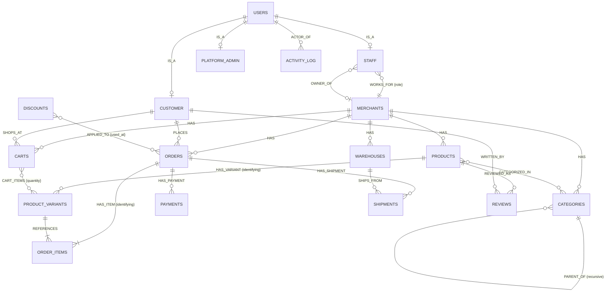

# COM2058 Project — Phase 2: ER Diagram Explanation

**Project:** StoreCraft — Multi-Tenant E-Commerce Platform SaaS
**Course:** COM2058 Database Management Systems, Ankara University
**Author:** Berk Kırık
**Date:** 2026-04-23
**Phase 2 Weight:** 20%
**Notation:** Chen ER (Elmasri & Navathe 6e Ch07, Fig 7.15 style)

**Files:**
- `phase2_er_diagram.drawio` — editable source, 1 page (ER schema, conceptual level)
- `phase2_er_diagram.png` — exported image (File → Export As → PNG, 200% zoom, white background)
- This document — element-by-element explanation

---

## How to Open & Export

```bash
# macOS — draw.io desktop app
open -a "draw.io" docs/phase2_er_diagram.drawio
# Then: File → Export As → PNG (Border 20, Zoom 200%, Background White)
# Save as: docs/phase2_er_diagram.png
```

Web alternative: open `docs/phase2_er_diagram.drawio` at https://app.diagrams.net

---

## Notation Key

| Symbol | Meaning |
|--------|---------|
| Rectangle | Entity type |
| **Double-bordered rectangle** | **Weak entity type** (no independent key) |
| Diamond | Relationship type |
| **Double-bordered diamond** | **Identifying relationship** (binds weak entity to owner) |
| `*` prefix in attribute list | Primary key attribute |
| `†` prefix | Composite attribute (e.g. `†address` = street + city + state + postal_code + country) |
| `‡` prefix | Derived attribute (computed, not stored) |
| `(PK-part)` in attribute | Partial key — part of a compound primary key |
| Single line on edge | **Partial participation** — entity may exist without participating |
| Double line on edge (`shape=link`) | **Total participation** — every instance must participate |
| `(min,max)` label on edge | Structural constraint (cardinality + participation combined) |

---

## Mermaid Quick-Reference (GitHub preview)

> The `.drawio` file is the canonical Phase 2 deliverable.  
> This Mermaid diagram is a simplified cross-check only — Mermaid does not support full Chen ER notation.



---

## Element-by-Element Walkthrough

Reading order: left → right, top → bottom, following the five functional zones.

---

### §1 — Identity Zone

**(1.1) `USERS` entity (top-left)**

The global supertype. All authenticated persons share these attributes:
`*user_id`, `email`, `password_hash`, `first_name`, `last_name`, `phone`, `is_active`, `created_at`.

In Ch07 ER (no EER specialization), the subtype relationship is modelled as three binary 1:1 `IS_A` relationships. USERS participates **partially** `(0,1)` — a freshly-registered account may not yet have a subtype row. Subtypes participate **totally** `(1,1)` — a CUSTOMER row cannot exist without a USERS row.

**(1.2) `CUSTOMER` subtype**

Extends USERS with shopping-specific attributes: `user_id (PK,FK)`, `†default_shipping_address`, `date_of_birth`, `loyalty_points`, `accepts_marketing`.

The composite attribute `†default_shipping_address` expands to `{street, city, state, postal_code, country}` per Elmasri Ch07 composite attribute semantics.

**(1.3) `STAFF` subtype**

Extends USERS with employment attributes: `user_id (PK,FK)`, `employment_type`, `hired_at`, `title`, `commission_rate`, `employment_status`.

**(1.4) `PLATFORM_ADMIN` subtype**

Extends USERS for StoreCraft internal team: `user_id (PK,FK)`, `admin_level`, `department`, `hired_at`.

---

### §2 — Merchants Zone

**(2.1) `MERCHANTS` entity (tenant root)**

One row = one store = one tenant. Every tenant-scoped entity carries `merchant_id` as a foreign key, enforcing tenant isolation at the schema level.

Attributes: `*merchant_id`, `slug`, `store_name`, `owner_user_id (FK→STAFF)`, `†business_address`, `contact_email`, `currency`, `plan`, `created_at`, `activated_at`, `suspended_at`.

**(2.2) `WORKS_FOR` diamond (M:N between STAFF and MERCHANTS, carries `{role}`)**

A staff member may work for multiple merchants; a merchant has multiple staff. This is a **many-to-many relationship with a relationship attribute** `{role}` (`owner` / `admin` / `staff` / `viewer`). The Ch07 rule is: M:N relationship attributes must stay on the relationship, not on either entity. This maps to the `merchant_staff(merchant_id, user_id, role)` bridge table in Phase 4.

Cardinality: STAFF `(0,N)` partial — a user may not be a staff member yet. MERCHANTS `(1,N)` total — every merchant must have at least one staff member (the owner).

**(2.3) `OWNER_OF` diamond (1:1 between STAFF and MERCHANTS)**

A separate 1:1 relationship capturing which specific staff member founded the merchant. STAFF `(0,1)` partial — not every staff member is a founding owner. MERCHANTS `(1,1)` total — every merchant must have exactly one owner. Represented in Phase 4 DDL as `merchants.owner_user_id FK → staff.user_id`.

---

### §3 — Catalog Zone

**(3.1) `PRODUCTS` entity**

The catalog base. Attributes: `*product_id`, `merchant_id (FK)`, `slug`, `title`, `product_type` (discriminator: `physical` / `digital` / `subscription`), `base_price`, `currency`, `status`, `created_at`, `updated_at`.

**(3.2) `HAS` diamond (1:N, MERCHANTS → PRODUCTS)**

A merchant owns N products; each product belongs to exactly one merchant. MERCHANTS `(0,N)` partial (a new merchant may have no products yet); PRODUCTS `(1,1)` total (every product must belong to a merchant).

**(3.3) `PRODUCT_VARIANTS` weak entity (double-bordered rectangle)**

Product variants have no independent existence — a "Red / L" variant is meaningless without its parent product. **Weak entity** per Ch07 §weak entity types: no key attribute of its own.

Attributes: `product_id (PK-part, FK)`, `variant_no (PK-part)`, `sku`, `option1_name`, `option1_value`, `price_override`, `barcode`, `is_default`.

Compound PK = `(product_id, variant_no)`. `variant_no` is the **partial key** — unique only within one product (1, 2, 3…).

**(3.4) `HAS_VARIANT` identifying relationship (double-bordered diamond)**

The identifying relationship that binds PRODUCT_VARIANTS to PRODUCTS. Always total participation on the weak entity side `(1,1)` — a variant cannot exist without its product. PRODUCTS `(0,N)` partial — a product may have no variants stored yet.

**(3.5) `CATEGORIES` entity**

Tenant-scoped category tree. Attributes: `*category_id`, `merchant_id (FK)`, `parent_category_id (FK, null)`, `slug`, `name`, `display_order`, `created_at`.

**(3.6) `CATEGORIZED_IN` diamond (M:N, PRODUCTS ↔ CATEGORIES)**

A product may appear in multiple categories (e.g. "Laptop" in both "Electronics" and "Computers"). Both sides `(0,N)` partial. Maps to `product_categories(product_id, category_id)` bridge in Phase 4.

**(3.7) `PARENT_OF` diamond (1:N recursive on CATEGORIES)**

Self-referencing relationship modelling the category tree. `parent_category_id` is a nullable self-FK. "child" side `(0,1)` — a category may have no parent (top-level). "parent" side `(0,N)` — a category may have zero or many child categories.

---

### §4 — Inventory Zone

**(4.1) `WAREHOUSES` entity**

Physical storage locations, tenant-scoped. Attributes: `*warehouse_id`, `merchant_id (FK)`, `name`, `†address`, `is_active`, `created_at`.

**(4.2) `HAS` diamond (1:N, MERCHANTS → WAREHOUSES)**

Each warehouse belongs to exactly one merchant. MERCHANTS `(0,N)` partial; WAREHOUSES `(1,1)` total.

**(4.3) `STOCKED_AT` ternary diamond (degree-3, M:N:N)**

A **genuine ternary relationship** per Ch07 §Relationship Types of Degree Higher than Two. Stock quantity is only defined by the triple `(product, variant, warehouse)` — no binary decomposition can express this without information loss.

Three participants, all partial `(0,N)`:
- `PRODUCTS` — a product may not yet be stocked anywhere
- `PRODUCT_VARIANTS` — a variant may not be in any warehouse yet
- `WAREHOUSES` — a warehouse may currently hold no stock

Relationship attributes (stored on the relationship itself per Ch07 M:N attribute rule): `qty_on_hand`, `qty_reserved`, `‡qty_available` (derived: `= qty_on_hand − qty_reserved`), `reorder_level`, `updated_at`.

Maps to the `inventory(product_id, variant_no, warehouse_id, merchant_id, qty_on_hand, qty_reserved, reorder_level, updated_at)` table in Phase 4, with compound PK `(product_id, variant_no, warehouse_id)`.

---

### §5 — Commerce Zone

**(5.1) `CARTS` entity**

Active shopping carts. Attributes: `*cart_id`, `merchant_id (FK)`, `customer_user_id (FK, null)`, `session_token`, `currency`, `status` (`active` / `abandoned` / `converted`), `expires_at`, `created_at`.

The nullable `customer_user_id` supports **guest checkout** (cart exists before the customer logs in). Once the customer logs in, the FK is populated.

**(5.2) `SHOPS_AT` diamond (1:N, CUSTOMER → CARTS)**

A customer may have multiple carts across merchants. Both sides partial `(0,N)` — a customer may have no active carts; a guest cart has no customer.

**(5.3) `CART_ITEMS` diamond (M:N, CARTS ↔ PRODUCT_VARIANTS, carries `{quantity}`)**

A cart holds N product variants; a variant may be in N carts. The relationship attribute `quantity` must sit on the diamond per Ch07 M:N rule. Maps to `cart_items(cart_id, product_id, variant_no, quantity)` in Phase 4.

**(5.4) `ORDERS` entity**

Finalized purchases — immutable once placed. Attributes: `*order_id`, `merchant_id (FK)`, `customer_user_id (FK)`, `order_number`, `status`, `†shipping_address`, `†billing_address`, `subtotal`, `discount_total`, `tax_total`, `‡grand_total` (derived: `subtotal − discount_total + tax_total + shipping_total`), `currency`, `placed_at`, `canceled_at`.

Address attributes are **composite** and are **snapshot-frozen** at order time — the customer's current address may change, but the order address must remain as it was at purchase.

**(5.5) `PLACES` diamond (1:N, CUSTOMER → ORDERS)**

A customer places N orders. CUSTOMER `(0,N)` partial; ORDERS `(1,1)` total — every order must have a registered customer.

**(5.6) `ORDER_ITEMS` weak entity (double-bordered rectangle)**

Line items have no identity outside their order. `line_no` is the **partial key** (1, 2, 3… per order).

Attributes: `order_id (PK-part, FK)`, `line_no (PK-part)`, `product_id (FK)`, `variant_no (FK)`, `product_title`, `variant_label`, `sku`, `unit_price`, `quantity`, `‡line_subtotal` (derived: `unit_price × quantity`).

The attributes `product_title`, `variant_label`, `sku`, `unit_price` are **snapshot denormalisations**: they are frozen at order-placement time so that historical orders remain accurate even if the catalog changes later. This controlled denormalization is justified and discussed in the Phase 4 report (Ch15).

**(5.7) `HAS_ITEM` identifying relationship (double-bordered diamond)**

Binds ORDER_ITEMS to ORDERS. Always total on weak-entity side `(1,1)`. ORDERS `(0,N)` partial (an order row may technically exist briefly before lines are committed in a transaction).

**(5.8) `REFERENCES` diamond (1:N, PRODUCT_VARIANTS → ORDER_ITEMS)**

Each order-item line references the specific variant ordered. PRODUCT_VARIANTS `(0,N)` partial; ORDER_ITEMS `(1,1)` total (every line must reference a variant — though the variant could later be deleted, the snapshot attributes preserve the description).

**(5.9) `HAS_PAYMENT` diamond (1:N, ORDERS → PAYMENTS)**

One order may generate multiple payment records (e.g. partial capture, retry, post-refund re-charge). ORDERS `(0,N)` partial; PAYMENTS `(1,1)` total.

**`PAYMENTS` entity:** `*payment_id`, `order_id (FK)`, `merchant_id (FK)`, `payment_method`, `amount`, `currency`, `status`, `gateway_reference`, `processed_at`, `created_at`.

**(5.10) `HAS_SHIPMENT` diamond (1:N, ORDERS → SHIPMENTS)**

One order may be split across warehouses into multiple shipments. Both sides partial `(0,N)` — an order may not yet have a shipment.

**(5.11) `SHIPS_FROM` diamond (1:N, WAREHOUSES → SHIPMENTS)**

Each shipment originates from exactly one warehouse. WAREHOUSES `(0,N)` partial; SHIPMENTS `(1,1)` total.

**`SHIPMENTS` entity:** `*shipment_id`, `order_id (FK)`, `merchant_id (FK)`, `warehouse_id (FK)`, `carrier`, `tracking_number`, `status`, `†shipping_address`, `shipped_at`, `delivered_at`, `created_at`.

---

### §6 — Engagement Zone

**(6.1) `REVIEWS` entity**

Customer product reviews. Attributes: `*review_id`, `product_id (FK)`, `customer_user_id (FK)`, `merchant_id (FK)`, `order_id (FK, null)`, `rating (1–5)`, `title`, `body`, `is_verified_purchase`, `helpful_count`, `status`, `created_at`.

The nullable `order_id` enables verified-purchase flagging without requiring it. Business rule: `UNIQUE (product_id, customer_user_id)` — one review per customer per product.

**(6.2) `REVIEWED_AS` diamond (1:N, PRODUCTS → REVIEWS)**

A product receives N reviews; each review is for exactly one product. PRODUCTS `(0,N)` partial; REVIEWS `(1,1)` total.

**(6.3) `WRITTEN_BY` diamond (1:N, CUSTOMER → REVIEWS)**

A customer writes N reviews; each review has exactly one author. CUSTOMER `(0,N)` partial; REVIEWS `(1,1)` total.

**(6.4) `DISCOUNTS` entity**

Promotion codes, tenant-scoped. Attributes: `*discount_id`, `merchant_id (FK)`, `code`, `discount_type`, `value`, `min_order_amount`, `max_uses`, `max_uses_per_customer`, `used_count`, `starts_at`, `ends_at`, `is_active`, `created_by (FK→STAFF)`.

**(6.5) `APPLIED_TO` diamond (M:N, DISCOUNTS ↔ ORDERS, carries `{used_at}`)**

A discount code may be applied to multiple orders; an order may use multiple codes (e.g. stacking). The relationship attribute `used_at` records the timestamp of redemption. Maps to `discount_usages(discount_id, order_id, used_at)` in Phase 4.

**(6.6) `ACTIVITY_LOG` entity (polymorphic audit)**

Append-only audit log. Attributes: `*event_id`, `merchant_id (FK)`, `actor_user_id (FK, null)`, `actor_type`, `entity_type`, `entity_id` **(no FK — polymorphic)**, `action`, `payload_json`, `ip_address`, `occurred_at`.

The `(entity_type, entity_id)` pair is a **polymorphic association** — `entity_id` can reference rows in any entity table depending on the value of `entity_type`. No database-level FK is possible on `entity_id`. This is a **controlled denormalisation**: a single uniform audit table is preferred over per-entity log tables, at the cost of referential integrity. Discussed further in the Phase 4 report (Ch15 normalisation trade-offs).

**(6.7) `ACTOR_OF` diamond (1:N, USERS → ACTIVITY_LOG)**

Each audit event is attributed to one user (actor). Null actor = system-generated event. USERS `(0,N)` partial (a user may have no logged events); ACTIVITY_LOG `(0,1)` partial on user side (system events have no user).

---

## Cardinality + Participation Summary Table

| # | Relationship | Left entity | Cardinality | Right entity | Left (min,max) | Right (min,max) |
|---|---|---|---|---|---|---|
| R1 | `USERS — IS_A — CUSTOMER` | USERS | 1:1 | CUSTOMER | (0,1) partial | (1,1) **total** |
| R2 | `USERS — IS_A — STAFF` | USERS | 1:1 | STAFF | (0,1) partial | (1,1) **total** |
| R3 | `USERS — IS_A — PLATFORM_ADMIN` | USERS | 1:1 | PLATFORM_ADMIN | (0,1) partial | (1,1) **total** |
| R4 | `STAFF — WORKS_FOR — MERCHANTS` | STAFF | M:N | MERCHANTS | (0,N) partial | (1,N) **total** |
| R5 | `STAFF — OWNER_OF — MERCHANTS` | STAFF | 1:1 | MERCHANTS | (0,1) partial | (1,1) **total** |
| R6 | `MERCHANTS — HAS — PRODUCTS` | MERCHANTS | 1:N | PRODUCTS | (0,N) partial | (1,1) **total** |
| R7 | `MERCHANTS — HAS — CATEGORIES` | MERCHANTS | 1:N | CATEGORIES | (0,N) partial | (1,1) **total** |
| R8 | `MERCHANTS — HAS — WAREHOUSES` | MERCHANTS | 1:N | WAREHOUSES | (0,N) partial | (1,1) **total** |
| R9 | `CATEGORIES — PARENT_OF — CATEGORIES` | CATEGORIES | 1:N recursive | CATEGORIES | (0,N) partial | (0,1) partial |
| R10 | `PRODUCTS — CATEGORIZED_IN — CATEGORIES` | PRODUCTS | M:N | CATEGORIES | (0,N) partial | (0,N) partial |
| R11 | `PRODUCTS — HAS_VARIANT — PRODUCT_VARIANTS` | PRODUCTS | 1:N **identifying** | PRODUCT_VARIANTS | (0,N) partial | (1,1) **total** |
| R12 | `STOCKED_AT (PRODUCTS × PRODUCT_VARIANTS × WAREHOUSES)` | — | **Ternary M:N:N** | — | all (0,N) partial | all (0,N) partial |
| R13 | `MERCHANTS — HAS — CARTS` | MERCHANTS | 1:N | CARTS | (0,N) partial | (1,1) **total** |
| R14 | `CUSTOMER — SHOPS_AT — CARTS` | CUSTOMER | 1:N | CARTS | (0,N) partial | (0,1) partial (guest cart = null) |
| R15 | `CARTS — CART_ITEMS — PRODUCT_VARIANTS` | CARTS | M:N | PRODUCT_VARIANTS | (0,N) partial | (0,N) partial |
| R16 | `MERCHANTS — HAS — ORDERS` | MERCHANTS | 1:N | ORDERS | (0,N) partial | (1,1) **total** |
| R17 | `CUSTOMER — PLACES — ORDERS` | CUSTOMER | 1:N | ORDERS | (0,N) partial | (1,1) **total** |
| R18 | `ORDERS — HAS_ITEM — ORDER_ITEMS` | ORDERS | 1:N **identifying** | ORDER_ITEMS | (0,N) partial | (1,1) **total** |
| R19 | `PRODUCT_VARIANTS — REFERENCES — ORDER_ITEMS` | PRODUCT_VARIANTS | 1:N | ORDER_ITEMS | (0,N) partial | (1,1) **total** |
| R20 | `ORDERS — HAS_PAYMENT — PAYMENTS` | ORDERS | 1:N | PAYMENTS | (0,N) partial | (1,1) **total** |
| R21 | `ORDERS — HAS_SHIPMENT — SHIPMENTS` | ORDERS | 1:N | SHIPMENTS | (0,N) partial | (1,1) **total** |
| R22 | `WAREHOUSES — SHIPS_FROM — SHIPMENTS` | WAREHOUSES | 1:N | SHIPMENTS | (0,N) partial | (1,1) **total** |
| R23 | `PRODUCTS — REVIEWED_AS — REVIEWS` | PRODUCTS | 1:N | REVIEWS | (0,N) partial | (1,1) **total** |
| R23b | `CUSTOMER — WRITTEN_BY — REVIEWS` | CUSTOMER | 1:N | REVIEWS | (0,N) partial | (1,1) **total** |
| R24 | `DISCOUNTS — APPLIED_TO — ORDERS` | DISCOUNTS | M:N | ORDERS | (0,N) partial | (0,N) partial |
| R25 | `USERS — ACTOR_OF — ACTIVITY_LOG` | USERS | 1:N | ACTIVITY_LOG | (0,N) partial | (0,1) partial (system events = null) |

---

## Phase 4 Mapping Notes

The following notes connect the ER design to the Phase 4 DDL (MySQL 8.0+ InnoDB).

1. **M:N relationships → bridge tables.** WORKS_FOR → `merchant_staff(merchant_id, user_id, role)`. CATEGORIZED_IN → `product_categories(product_id, category_id)`. CART_ITEMS → `cart_items(cart_id, product_id, variant_no, quantity)`. APPLIED_TO → `discount_usages(discount_id, order_id, used_at)`.

2. **Weak entities → compound PKs.** PRODUCT_VARIANTS PK = `(product_id, variant_no)`. ORDER_ITEMS PK = `(order_id, line_no)`. MySQL `ENGINE=InnoDB` required for FK enforcement; `TINYINT(1)` used for BOOLEAN columns; `DATETIME` preferred over `TIMESTAMP` to avoid the year-2038 range limit.

3. **Ternary STOCKED_AT → `inventory` table.** PK = `(product_id, variant_no, warehouse_id)`. `qty_available` stored as a MySQL generated column (`AS (qty_on_hand - qty_reserved) STORED`) rather than a regular column, implementing the derived-attribute semantics from the ER model.

---

## Design Decisions

| Topic | Decision | Rationale |
|---|---|---|
| ISA as 1:1 binary (not EER ◯d notation) | Ch07 ER only — no EER in scope | Phase 2 covers Ch07; EER (Ch08) is out of scope |
| Overlapping subtypes | One person can be CUSTOMER and STAFF simultaneously | A store owner shops on other merchants' stores |
| Genuine ternary STOCKED_AT | Three-way diamond | Binary decomposition loses per-variant-per-warehouse quantity |
| ORDER_ITEMS snapshot | Frozen title/sku/unit_price | Price changes after order placement must not affect history |
| ACTIVITY_LOG polymorphic | No FK on entity_id | Single audit table vs per-entity tables — controlled denorm |
| MySQL 8.0+ | Application requirement | No deferrable FKs; insertion order enforced at app level |

---

*StoreCraft · COM2058 Phase 2 — ER Explanation · Author: Berk Kırık · Notation: Elmasri & Navathe 6e (Ch07) · MySQL 8.0+*
